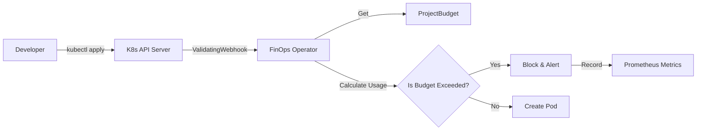

# 🛡️ K8s FinOps Governance Operator

> **Radical Truth for Kubernetes Costs:** Stop cost overruns *before* they happen.


## 📋 Overview

The **K8s FinOps Governance Operator** is a Kubernetes-native controller designed to enforce strict financial boundaries at the infrastructure level. Unlike traditional FinOps tools that *report* costs after the fact (bill shock), this operator implements **Pre-emptive Cost Control**.

It uses a **Validating Webhook** to intercept every Pod creation request, calculates the projected cost against a defined `ProjectBudget` CRD, and **rejects** workloads that would violate financial policies.

### The Problem it Solves
* **"The Cloud Bill Shock":** Developers deploying over-provisioned resources without limits.
* **"The Tragedy of the Commons":** Teams consuming shared cluster resources without accountability.

### The Solution
* **Zero-Inference Enforcement:** If the budget is full, the Pod is denied. No exceptions.
* **Real-Time ROI Tracking:** Built-in Prometheus metrics to quantify "saved" costs immediately.

---

## 🚀 Key Features

* **⚡ Admission Control Logic:** Intercepts Pods in <20ms to validate CPU requests against team budgets.
* **💰 ProjectBudget CRD:** Custom resource to define financial limits per team/namespace (e.g., `team-beta` gets `2000m` CPU).
* **📊 Native Observability:** Exposes custom Prometheus metrics to track denied pods and saved CPU resources.
* **✅ Fail-Safe Architecture:** Designed to "fail-open" if no budget is present, ensuring critical operations aren't blocked by misconfiguration.
* **🧪 Engineering Excellence:** Fully tested with Unit Tests (Controller logic) and E2E Tests (Kind cluster integration).

---

## 🛠️ Architecture



---

## 🚦 Quick Start

### Prerequisites

* Kubernetes Cluster (v1.28+)
* `kubectl` installed
* `make`

### Installation

Deploy the operator to your cluster:

```bash
# 1. Install CRDs and Deploy Controller
make deploy IMG=acasa93/k8s-finops-operator:v0.5.0

```

### Usage Example

1. **Define a Budget:** Create a strict limit for a team.

```yaml
# budget.yaml
apiVersion: finops.acasa.acme/v1
kind: ProjectBudget
metadata:
  name: beta-budget
spec:
  teamName: "team-beta"
  maxCpuLimit: "200m" # Strict limit

```

2. **Apply it:**

```bash
kubectl apply -f budget.yaml

```

3. **Attempt a Violation:** Try to deploy a pod that exceeds the limit.

```bash
# This requires 500m, but limit is 200m.
kubectl run fatal-attack --image=nginx --restart=Never -n team-beta --limits=cpu=500m

```

4. **Result:**

```text
Error from server (Forbidden): admission webhook "vpod.kb.io" denied the request: 
DENIED by FinOps: Budget exceeded for team 'team-beta'. Used: 0m, Limit: 200m, Request: 500m

```

---

## 📈 Observability & Metrics

The operator instruments every decision. Connect Prometheus to port `8443` to visualize the ROI.

| Metric Name | Type | Description |
| --- | --- | --- |
| `finops_rejected_pods_total` | Counter | Total number of pods blocked due to budget overflow. |
| `finops_saved_cpu_millicores_total` | Counter | Total CPU (millicores) prevented from being provisioned ("Money Saved"). |

**Manual Verification:**
You can query the metrics endpoint securely using the service account token:

```bash
# 1. Forward the metrics port
kubectl port-forward svc/k8s-governance-operator-controller-manager-metrics-service -n k8s-governance-operator-system 8443:8443

# 2. Get a valid token
TOKEN=$(kubectl create token k8s-governance-operator-controller-manager -n k8s-governance-operator-system)

# 3. Query metrics
curl -k -H "Authorization: Bearer $TOKEN" https://localhost:8443/metrics | grep finops

```

---

## 🧪 Testing Strategy

This project enforces a strict testing pyramid:

* **Unit Tests:** Validate reconciliation loops and webhook logic.
```bash
make test

```


* **E2E Tests:** Spin up a local Kind cluster, install the operator, and run live attack scenarios.
```bash
make test-e2e

```


---

## 📜 License

Copyright 2026 Alejandro Casa.
Licensed under the Apache License, Version 2.0.
